<!-- ============================================================
     Replace  SEU_USUARIO  with your GitHub username
     and  REPO_1 / REPO_2 / REPO_3 / REPO_4  with your repository names.
     ============================================================ -->

  
  

  

  

  
  

---

## 👨‍💻 About me

- 🧩 **TOTVS Protheus Specialist**
- 💙 Passionate about **Delphi**
- ⚙️ I build with **AdvPL / TLPP**, **Angular**, **C#** and **JavaScript**
- 🤝 Open to connections and knowledge sharing — reach me on [LinkedIn](https://www.linkedin.com/in/michael-maximino-35a41224/)

 

---

## 🛠️ Tech stack

  
  
  
  
  
  

  

---

## 📊 Stats

  

---

## 🐍 Contributions

  <picture>
    <source media="(prefers-color-scheme: dark)" srcset="https://raw.githubusercontent.com/SEU_USUARIO/SEU_USUARIO/output/github-snake-dark.svg">
    <source media="(prefers-color-scheme: light)" srcset="https://raw.githubusercontent.com/SEU_USUARIO/SEU_USUARIO/output/github-snake-light.svg">
    
  </picture>

---

## 🌐 Social

  
  

  

